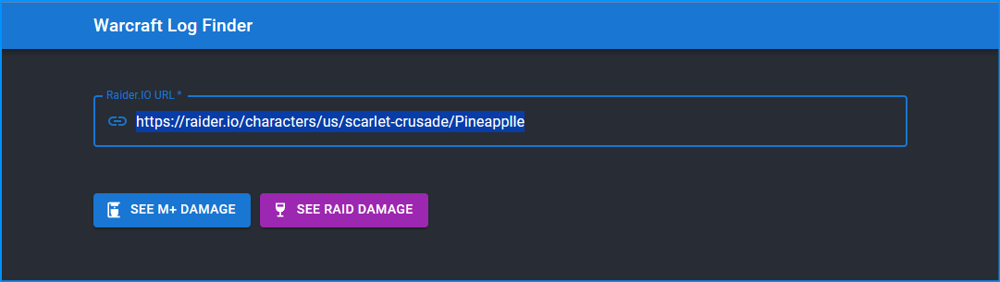

# Log Finder

Gives a quick way to find the logs given a Raider IO URL. Especially useful at quickly finding out people's Mythic+ damage parses.

## How to Use

### Assumptions

1. You already have `yarn` & Node.js version 18 or higher installed. If not, I recommend [nvm](https://github.com/nvm-sh/nvm) for macOS & [nvm4w](https://github.com/coreybutler/nvm-windows) for Windows.
2. You know what Warcraft Logs is, and you understand the importance of seeing applicant's logs before inviting them to your group.

### Build & Run

1. Clone the repository.
2. Run `yarn install` to install the dependencies.
3. Run `yarn build` to build the application.
4. Run `npx serve -s build` to serve the production build. Your npx might ask if you want to install `serve@some-version`; type `y` to proceed.
5. Your terminal should tell you where the application is served. Usually it's [http://localhost:3000](http://localhost:3000).

### Usage

1. In game, copy the applicant's Raider.IO URL.
2. Paste the URL in the input field.
3. Use the mouse middle button to click on both buttons, so you can see both their current Mythic+ season's damage, and the latest raid tier damage.

### Development & Testing

If you'd like to modify the application, follow these steps:

1. Run `yarn start` to start the development server. 
2. Run `yarn test` to run the tests.